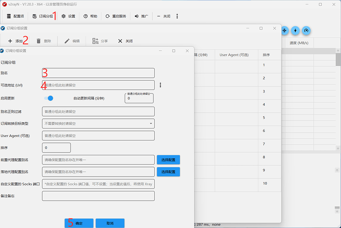
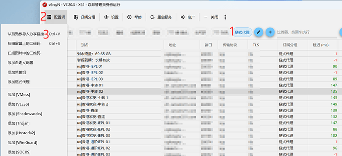
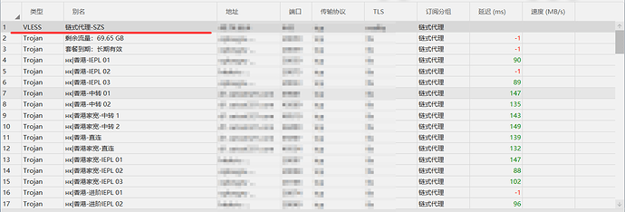
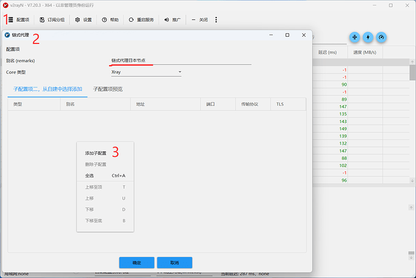
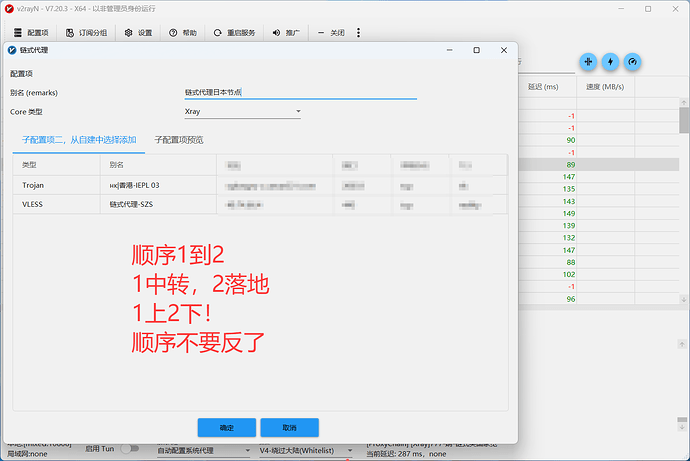
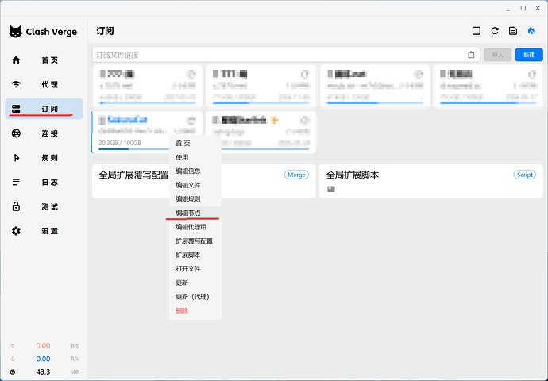
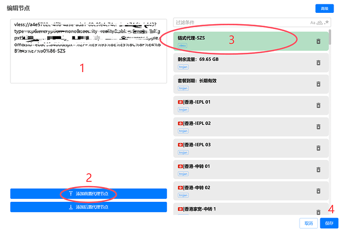
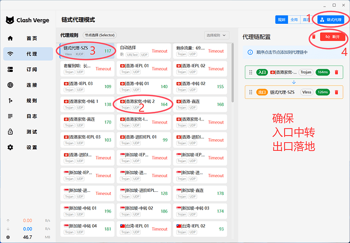
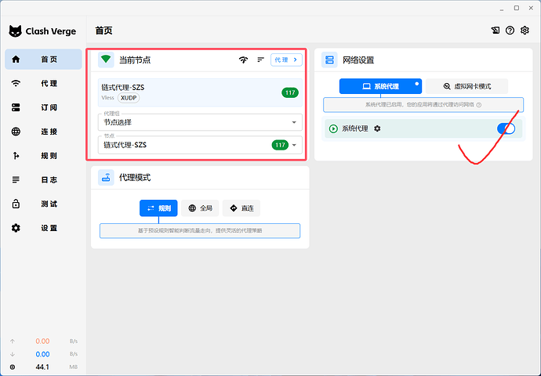

## 1. 什么是链式代理？为什么要这么搞？

链式代理就是让你的网络流量连续穿过**两个**代理服务器，也就是“代理套娃”。  
目的是用双倍的流量成本，换取极速的网络加上干净独享的 IP。

## 2. 核心架构图解

text

[本地客户端] → [机场专线前置节点] → [个人独享落地节点] → [目标网站/服务]

- **机场专线前置节点**：负责提供稳定、低延迟的国际出口通道
    
- **个人独享落地节点**：负责提供原生、干净的最终出口 IP
    

## 3. 准备工作

#### 必备条件

- 代理软件（V2rayN 或 Clash Verge Rev）
    
- 优质的机场前置节点
    
- 落地节点
    

#### 软件下载（请更新到最新版本）

- **V2rayN**：GitHub Releases 页面搜索 [2dust/v2rayN](`https://github.com/2dust/v2rayN/releases`)
    
- **Clash Verge Rev**：GitHub Releases 页面搜索  [clash-verge-rev/clash-verge](`https://github.com/clash-verge-rev/clash-verge-rev/releases`)
    

> 💡 **实测提示**：V2rayN 比 Clash Verge Rev 稳定很多！

#### 节点说明

- **个人节点搭建**：可参考后续白嫖微软 + 个人节点搭建教程
    
- **前置节点**：机场、线路机等均可使用，教程通用
    

## 4. V2rayN 教程

#### 4.1 导入节点与订阅

点击1-2-3-4，添加机场订阅

在机场分组（1）里面，点击2-3添加落地节点

添加落地节点如下：

#### 4.2 创建“链式代理”配置

点击1-2-3添加中转节点和落地节点

添加后如下+注意事项：不要弄错顺序！！！

#### 4.3 使用

点击1-3使用搭建的链式代理,2有延迟代表链式代理成功！

## 5、Clash Verge Rev教程

#### 5.1 导入落地节点

在订阅中转机场右键编辑节点

点击1-2添加落地节点，看到3点击保存！

#### 5.2 创建“链式代理”配置
在代理选项中，点击1-2-3-4。2是中转节点（机场），3是落地节点

#### 5.3 使用
点击对号使用
