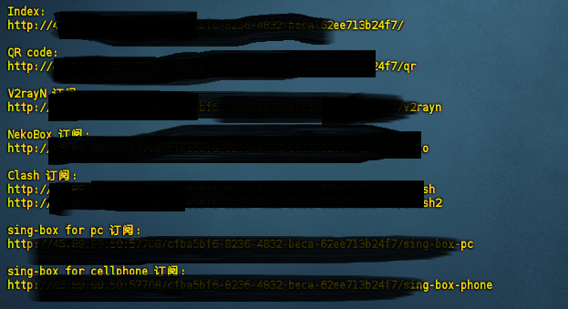
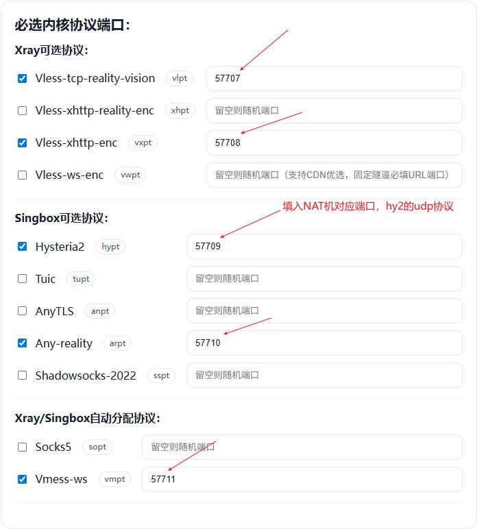
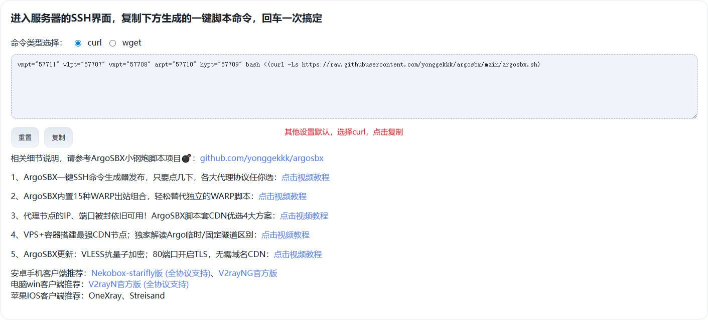

### 一、**Debian 系统安装 Hysteria2**

**1. 一键搭建命令**

```
wget -N --no-check-certificate <https://raw.githubusercontent.com/flame1ce/hysteria2-install/main/hysteria2-install-main/hy2/hysteria.sh> && bash hysteria.sh
```

**2. 设置服务器端口（UDP）**

- 在防火墙和路由器中开放对应的UDP端口，确保外部可以访问。
- 例如，默认端口可以设置为 `40443`，根据实际需求调整。
### **二、Alpine 系统安装 Hysteria2**

**1. 更新系统**

```
apk update && apk upgrade

```

**2. 一键搭建命令**

```
wget -O hy2.sh <https://raw.githubusercontent.com/zrlhk/alpine-hysteria2/main/hy2.sh>  && sh hy2.sh

```

> 注意：如果搭建未成功，可以重复执行该命令，脚本会覆盖之前的密码。


**3. 配置客户端（以 v2rayN 为例）**

- **别名**：自定义名称，如 `XXX`
- **地址**：服务器公网 IP 地址
- **端口**：`40443`（或你设置的端口）
- **密码**：脚本安装时生成的密码（可在服务器脚本输出或配置文件中查看）
- **传输层安全**：TLS
- **SNI**：`bing.com`（可根据需要修改）
- **跳过证书验证**：勾选 `True`


**4. 服务器 NAT 端口转发**

- 必须设置 UDP 端口转发，确保 UDP 流量能够正确转发到服务器。
- 例如，将服务器的 UDP 40443 端口转发到服务器对应端口。


**5.更换端口的完整步骤**

- **停止 Hysteria 服务**：

bash

```
rc-service hysteria stop
```

- **编辑配置文件**：

bash

```
nano /etc/hysteria/config.yaml
```

- **修改端口号**（找到 `listen` 行）：

yaml

```
listen: :40444# 将40443改为您想要的新端口
```

- **重启服务**：

bash

```
rc-service hysteria start
```

- **验证服务状态**：

bash

```
rc-service hysteria status
ps aux | grep hysteria
```

- **检查新端口是否在监听**

bash

```
netstat -tulpn | grep :40444
# 或者
ss -tulpn | grep :40444
```

### 三、**NAT IP 被墙后转用 VMESS/VLESS**

**1、一键搭建代码**

```
curl -fsSL <https://raw.githubusercontent.com/eooce/ssh_tool/main/ssh_tool.sh> -o ssh_tool.sh && chmod +x ssh_tool.sh && ./ssh_tool.sh
```

**2、选择12.节点搭建合集**


**3、这我选择的1（1.F佬Sing-box一键脚本）**


**4、选择1**


**5、选择a**


**6、这个是重点，根据自己服务器提供的端口输入**


**7、服务器NAT端口转发一定要设置**


**8、自己有argo域名就写自己的，没有就直接默认**


**9、复制，导入到对应软件就可以了**


视频教程：[https://pan.quark.cn/s/f40a3a49534d](https://pan.quark.cn/s/f40a3a49534d)

### 四、VMess**一键脚本**

```jsx
bash <(curl -Ls <https://main.ssss.nyc.mn/sb.sh>)
```

### 五、NAT小机**最简单的搭建节点教程**

安装命令一键生成：[https://yonggekkk.github.io/argosbx/](https://yonggekkk.github.io/argosbx/)

